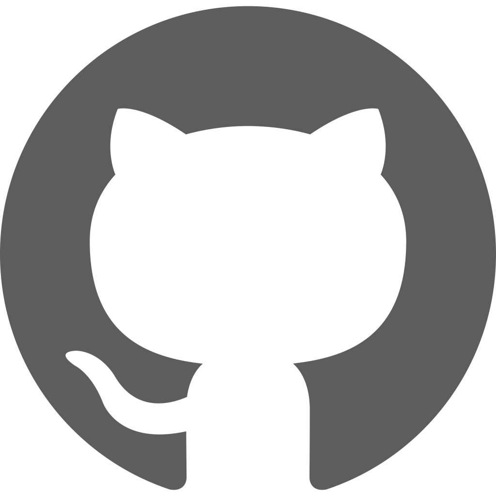

<h1 align="center">Welcolme to my GitHub profile👋! </h1>

## **1. About me**

<!--Hi! My name is JiaCheng Zhang and Im DAM's Student in [_IES Luis Vives_](https://github.com/IESLuisVives) (Spain, Madrid)🏫. 

Im Chinese but I was born in Spain. Im able to speak 3 languages: Chinese (Aproximately HSK-5 Level (NOT certified)), English (Certified by [_LanguageCert Level 1 Certificate in ESOL International Comunicator Level B2_](https://www.languagecert.org/en/language-exams/english/languagecert-selt/b2-lrws-2716)) and Spanish (Native level). 

I am a computer💻 and videogames🎮 enthusiast who's willing to learn.

____-->

Hola! Mi nombre es JiaCheng Zhang y soy estudiante de 1ºDAM en el [_IES Luis Vives_](https://github.com/IESLuisVives) 🏫.

Soy de nacionalidad china pero he nacido en España. Soy capaz de hablar 3 idiomas: Chino (Aproximadamente HSK-5 (NO certificado)), Inglés (Certificado por [_LanguageCert Level 1 Certificate in ESOL International Comunicator Level B2_](https://www.languagecert.org/en/language-exams/english/languagecert-selt/b2-lrws-2716)) y Español (Nivel Nativo). 

Soy un aficionado a la informática💻 y a los videojuegos🎮 y siempre estoy dispuesto a aprender. 

## **2. Contact**

📧Email Address: 
- _jiachengmadrid@gmail.com_
- _jiacheng.zhang@alumno.iesluisvives.org_

## **3. Working Experience**   

- Some experience as a restaurant waiter🍽️. 
  
- To be continued...🚀

## **4. Other**

 - 🌱 I’m currently learning Kotlin and Java

## **5. Technologies & tools**

   </a>   

## **6. Activity**

    
    

  

  

  

## **7. End**

<!--
**JiaChengZhang14/JiaChengZhang14** is a ✨ _special_ ✨ repository because its `README.md` (this file) appears on your GitHub profile.

Here are some ideas to get you started:

- 🔭 I’m currently working on ...
- 🌱 I’m currently learning ...
- 👯 I’m looking to collaborate on ...
- 🤔 I’m looking for help with ...
- 💬 Ask me about ...
- 📫 How to reach me: ...
- 😄 Pronouns: ...
- ⚡ Fun fact: ...
-->
